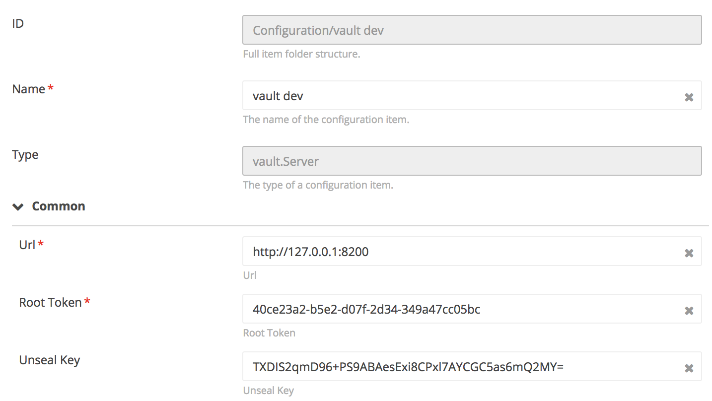
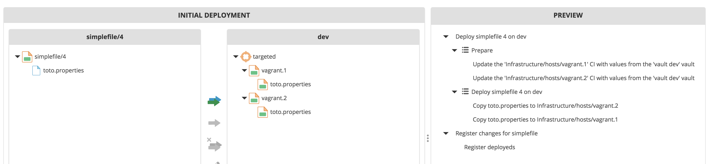

# HashiCorp Vault plugin for XLDeploy

[![Build Status][xld-hashicorp-vault-plugin-travis-image]][xld-hashicorp-vault-plugin-travis-url]
[![Codacy Badge][xld-hashicorp-vault-plugin-codacy-image] ][xld-hashicorp-vault-plugin-codacy-url]
[![Code Climate][xld-hashicorp-vault-plugin-code-climate-image] ][xld-hashicorp-vault-plugin-code-climate-url]
[![License: MIT][xld-hashicorp-vault-plugin-license-image] ][xld-hashicorp-vault-plugin-license-url]
[![Github All Releases][xld-hashicorp-vault-plugin-downloads-image] ]()


[xld-hashicorp-vault-plugin-travis-image]: https://travis-ci.org/xebialabs-community/xld-hashicorp-vault-plugin.svg?branch=master
[xld-hashicorp-vault-plugin-travis-url]: https://travis-ci.org/xebialabs-community/xld-hashicorp-vault-plugin
[xld-hashicorp-vault-plugin-codacy-image]: https://api.codacy.com/project/badge/Grade/49e14532522f4d6f8326b1899efd8cd3
[xld-hashicorp-vault-plugin-codacy-url]: https://www.codacy.com/app/joris-dewinne/xld-hashicorp-vault-plugin
[xld-hashicorp-vault-plugin-code-climate-image]: https://codeclimate.com/github/xebialabs-community/xld-hashicorp-vault-plugin/badges/gpa.svg
[xld-hashicorp-vault-plugin-code-climate-url]: https://codeclimate.com/github/xebialabs-community/xld-hashicorp-vault-plugin
[xld-hashicorp-vault-plugin-license-image]: https://img.shields.io/badge/License-MIT-yellow.svg
[xld-hashicorp-vault-plugin-license-url]: https://opensource.org/licenses/MIT
[xld-hashicorp-vault-plugin-downloads-image]: https://img.shields.io/github/downloads/xebialabs-community/xld-hashicorp-vault-plugin/total.svg

## Overview

The [HashiCorp Vault](https://www.vaultproject.io/) plugin is an XL Deploy plugin that fetch information for a host into a Vault server:username, password, private key file path,...

## Requirements

* **XL Deploy requirements**
	* **XL Deploy**: version 6.0.+

## Installation

Place the plugin `xldp` file into your `SERVER_HOME/plugins` directory.

## Usage

Define one or more `vault.Server` CI is under the 'Configuration' Node.

All the host types have extra properties to link them to a key in a vault
* managedByVault (default false) 
* vaultServer
* vaultKey an alternative key to look up in the vault, instead it is secret/[ci.id]


## Setup


### Vault server

Start a vault server for exemple using the development mode: 

```
vault server -dev
```

From the output, create a new ci of type `vault.Server` under the node configuration
```
The only step you need to take is to set the following
environment variables:

    export VAULT_ADDR='http://127.0.0.1:8200'

The unseal key and root token are reproduced below in case you
want to seal/unseal the Vault or play with authentication.

Unseal Key: TXDIS2qmD96+PS9ABAesExi8CPxl7AYCGC5as6mQ2MY=
Root Token: 40ce23a2-b5e2-d07f-2d34-349a47cc05bc
```



### Add Data in the vault

```
vault write secret/Infrastructure/hosts/vagrant.1 username=ubuntu password=ubuntu
vault write secret/Infrastructure/hosts/vagrant.2 username=ubuntu password=ubuntu

```

### Define Vaulted-Hosts in the Repository 

This is the [Deployfile](https://pypi.python.org/pypi/xld-py-cli/).

```
xld {
    scope(
            forInfrastructure: 'Infrastructure/hosts'
    ) {
        infrastructure('vagrant.1', 'overthere.SshHost') {
            os = com.xebialabs.overthere.OperatingSystemFamily.UNIX
            managedByVault = true
            vaultServer = ref('Configuration/vault dev')
            address = '127.0.0.1'
            port = 2222
            username = 'vagrant'
            password = 'vagrant'
        }
        infrastructure('vagrant.2', 'overthere.SshHost') {
            os = com.xebialabs.overthere.OperatingSystemFamily.UNIX
            managedByVault = true
            vaultServer = ref('Configuration/vault dev')
            address = '127.0.0.1'
            port = 2222
            username = 'vagrant'
            password = 'vagrant'
        }
    }
    scope(
            forEnvironments: 'Environments/vault-demo'
    ) {
        environment('dev') {
            members = [
                    ref('Infrastructure/hosts/vagrant.1'),
                    ref('Infrastructure/hosts/vagrant.2')
            ]
        }
    }
}
```

### import the application

e.g simplefile-4.dar

### Deploy it !




